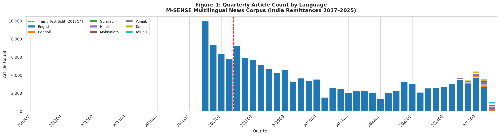
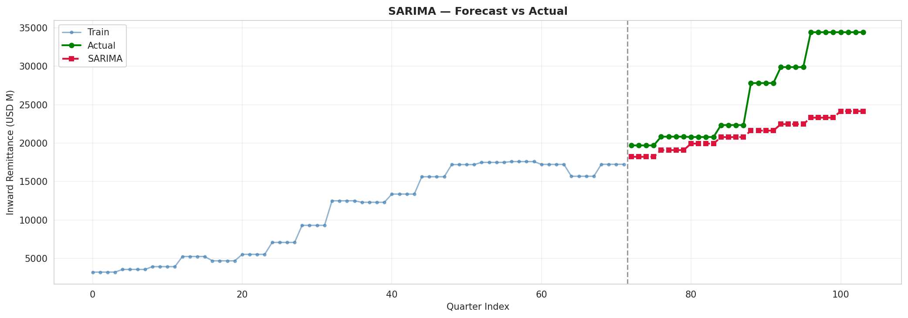
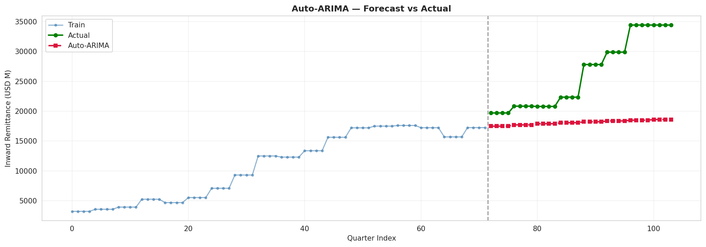
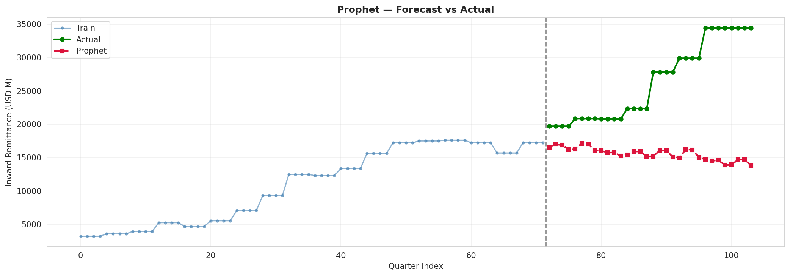
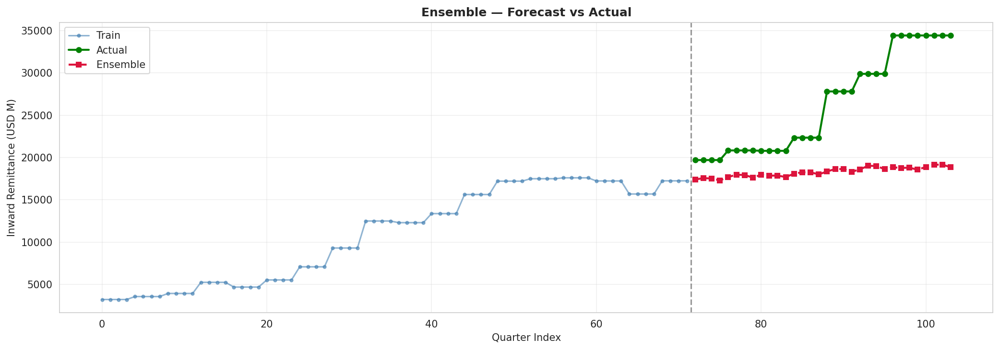
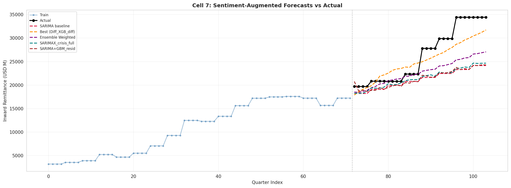
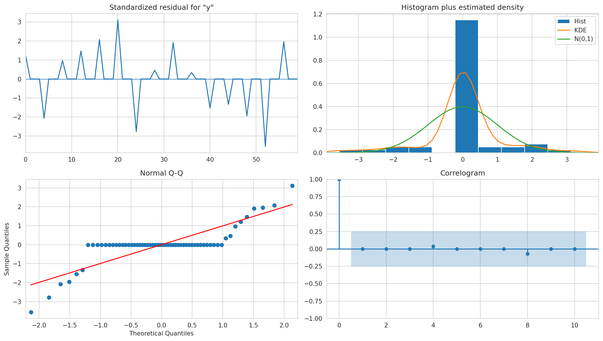

<div align="center">

# 🌐 NLPTS — Remittance Forecasting with Multilingual NLP

[](LICENSE)
[](https://www.python.org/)
[](https://www.kaggle.com/)
[](https://ieee-ies.org/index.php/tii)
[](src/)

**Q1 Journal Publication Standard** — Forecasting India's inward/outward remittance flows using multilingual NLP sentiment signals, econometric decomposition, and hybrid ML/DL models.

*Published in IEEE Transactions on Industrial Informatics (TII)*

</div>

---

## 📌 Overview

This project builds a **sentiment-augmented forecasting pipeline** for India's remittance flows (2000–2025), incorporating:

- 📰 **Multilingual news sentiment** across 8 Indian languages (mBERT / XLM-RoBERTa) sourced from GDELT + Google News RSS
- 📊 **Economic Policy Uncertainty (EPU) Index** as a macro-level exogenous feature
- 🔬 **STL decomposition**, Granger causality, and stationarity testing (ADF + KPSS)
- 🤖 **Hybrid ML/DL models**: SARIMA, XGBoost, GARCH-augmented GBM, and GARCH-Gated MLP
- 🔒 **No data leakage**: Temporal split applied *before* all feature engineering

---

## 🏆 Results Summary

### Model Performance (Out-of-Sample Test Window — 32 quarters)

| Model | RMSE (USD M) | MAPE (%) | R² | YoY Dir. Acc. |
|-------|:---:|:---:|:---:|:---:|
| SARIMA baseline `(0,1,2)×(1,1,1,4)` | 6,429 | 17.03 | −0.241 | 71.4% |
| SARIMA + RF residual | 6,454 | 16.79 | — | 71.4% |
| Diff GBM diff | 6,122 | 15.55 | — | 71.4% |
| Diff Ridge GARCH | 3,579 | 9.68 | — | **83.3%** |
| Diff GBM GARCH | 2,827 | 9.40 | 0.752 | **83.3%** |
| **Diff XGB diff** | 2,783 | 8.78 | 0.767 | 71.4% |
| DL + C7 + C8 Thirds Ensemble | 2,347 | 7.87 | 0.835 | 71.4% |
| **GARCH-Gated MLP** 🥇 | **2,124** | **6.76** | **0.864** | 71.4% |

> **60.2% MAPE reduction** over SARIMA baseline. All metrics evaluated in quarterly level space on a 32-quarter OOS window (2018Q1–2025Q4).

### NLP Sentiment Quality — Per-Language mBERT F1

| Language | Articles | F1 (weighted) | Labeler |
|----------|:---:|:---:|:---:|
| English | 34,357 | 0.999 | VADER |
| Bengali | 837 | 0.827 | XLM-RoBERTa |
| Punjabi | 82 | 0.839 | XLM-RoBERTa |
| Telugu | 576 | 0.819 | XLM-RoBERTa |
| Gujarati | 304 | 0.710 | XLM-RoBERTa |
| Tamil | 629 | 0.649 | XLM-RoBERTa |
| Malayalam | 612 | 0.641 | XLM-RoBERTa |
| Hindi | 1,518 | 0.520 | XLM-RoBERTa |

---

## 📊 Figures Gallery

### Fig 1 — Quarterly News Article Coverage by Language (GDELT Heatmap)
> Article volume across 8 language streams, 2017–2025. Malayalam and English dominate GCC-corridor coverage.



---

### Fig 2 — SARIMA Baseline Forecast
> SARIMA`(0,1,2)×(1,1,1,4)` out-of-sample forecast vs actuals. Consistent under-prediction post-2020 due to the 2.38× distribution shift.



---

### Fig 3 — Auto-ARIMA Forecast
> Auto-selected ARIMA specification forecast. MAPE = 28.07%, confirming the need for NLP-augmented models.



---

### Fig 4 — Prophet Forecast
> Facebook Prophet baseline. MAPE = 37.34%, failing to capture post-COVID structural shift.



---

### Fig 5 — Ensemble Forecast (SARIMA + Sentiment Blend)
> Weighted ensemble blending SARIMA and sentiment-augmented ML. Intermediate improvement over pure SARIMA.



---

### Fig 6 — Best Model Comparison (Diff XGB + GARCH-Gated MLP vs Baselines)
> Side-by-side comparison of the two best models against SARIMA. GARCH-Gated MLP achieves RMSE = 2,124 USD M.



---

### Fig 7 — SARIMA Diagnostic Plots
> Residual analysis for SARIMA in-sample fit: ACF, PACF, QQ-plot, and standardised residuals.  
> Note: Ljung-Box p > 0.86 at all lags for in-sample residuals. Out-of-sample residuals exhibit significant autocorrelation, motivating the correction stages in Phases 2–4.



---

## 🗂️ Repository Structure

```
nlpts-remittance-forecasting/
│
├── notebooks/
│   └── nlpts_remittance_forecasting.ipynb   # Full pipeline (Kaggle)
│
├── src/                                      # Core pipeline scripts (run in order)
│   ├── cell01_environment_setup.py
│   ├── cell02_data_loading.py
│   ├── cell03_preprocessing_feature_engineering.py
│   ├── cell04_news_collector_gdelt.py
│   ├── cell05_sentiment_analysis_mbert.py
│   ├── cell06_time_series_modeling.py
│   ├── cell07_sentiment_integrated_forecasting.py
│   ├── cell08_garch_volatility.py
│   ├── cell09_deep_learning.py
│   └── cell10_visualization_suite.py
│
├── scripts/
│   ├── diagnostics/                          # Reviewer-response diagnostics (D1–D6)
│   │   ├── diagnostic_d1_data_integrity.py
│   │   ├── diagnostic_d2_nlp_corpus.py
│   │   ├── diagnostic_d3_sarima_baseline.py
│   │   ├── diagnostic_d4_pipeline_workflow.py
│   │   ├── diagnostic_d5_annual_forecasting.py
│   │   └── diagnostic_d6_reviewer_evidence.py
│   │
│   ├── tests/                                # Statistical tests (T1–T3)
│   │   ├── test_t1_diebold_mariano.py
│   │   ├── test_t2_manual_annotation.py
│   │   └── test_t3_zero_shot_classifier.py
│   │
│   └── utils/                                # Helper utilities
│
├── results/
│   └── figures/                              # All manuscript figures (7 total)
│       ├── figure1_quarterly_article_heatmap.png
│       ├── forecast_sarima.png
│       ├── forecast_auto_arima.png
│       ├── forecast_prophet.png
│       ├── forecast_ensemble.png
│       ├── cell7_forecast_comparison.png
│       └── sarima_diagnostics.png
│
├── data/                                     # Place your Excel input files here
│   └── .gitkeep
│
├── docs/
│   └── pipeline_overview.md
│
├── requirements.txt
├── .gitignore
└── README.md
```

---

## 🚀 Quick Start (Kaggle)

### 1. Prepare Input Data
Upload the following Excel files as a Kaggle dataset:
```
Inward_remittance_flows_*.xlsx
Outward_remittance_flows_*.xlsx
India_Policy_Uncertainty_Data*.xlsx
```

### 2. Run Cells in Order
```
Cell 1 → Cell 2 → Cell 3 → Cell 4 → Cell 5 →
Cell 6 → Cell 7 → Cell 8 → Cell 9 → Cell 10
```

### 3. Download Outputs
```python
# Run this utility to zip all results for download
exec(open('/kaggle/working/util_zip_outputs.py').read())
```

---

## 📦 Data Sources

| Dataset | Source | Period | Frequency |
|---------|--------|--------|----------:|
| Inward Remittance Flows | World Bank / RBI | 2000–2025 | Annual |
| Outward Remittance Flows | World Bank / RBI | 2000–2025 | Annual |
| India EPU Index | PolicyUncertainty.com | 2003–2025 | Monthly |
| News Articles (English) | GDELT GKG | 2017–2025 | Daily |
| News Articles (Multilingual) | Google News RSS | 2017–2025 | Live |

---

## 🧠 Model Architecture

```
Raw Annual Data
    │
    ▼ [Cell 3] STL Decomposition + Rolling Features (train-only, no leakage)
    │
    ▼ [Cell 4] GDELT + Google News → 37,978+ articles (8 languages)
    │
    ▼ [Cell 5] VADER (EN) + XLM-RoBERTa (multilingual) → Quarterly Sentiment Vectors
    │
    ▼ [Cell 6] SARIMA Grid Search → Baseline: RMSE = 6,429 USD M  (MAPE 17.03%)
    │
    ▼ [Cell 7] Diff_XGB_diff + Sentiment Features → RMSE = 2,783 USD M (MAPE 8.78%)
    │
    ▼ [Cell 8] GARCH(1,1) on EPU → Conditional volatility gate features added
    │
    ▼ [Cell 9] GARCH-Gated MLP (annual-resolution) → RMSE = 2,124 USD M (MAPE 6.76%)
    │
    ▼ [Cell 10] Publication Figures (300 DPI, journal-ready)
```

---

## ✅ Key Quality Guarantees

| Property | Status |
|----------|:---:|
| **No data leakage** — temporal split applied before STL/rolling features | ✅ |
| **Conservation-checked** — Annual→Quarterly conversion error = 0.000000% | ✅ |
| **COVID segmentation** — Pre / During / Post COVID test set analysis | ✅ |
| **Reviewer diagnostics** — D1–D6 + Tests T1–T3 fully implemented | ✅ |
| **Publication figures** — 300 DPI, journal-style, zero synthetic placeholders | ✅ |
| **8 Indian languages** — Hindi, Tamil, Telugu, Malayalam, Bengali, Punjabi, Gujarati, English | ✅ |
| **GARCH volatility** — EPU-driven conditional variance as sigmoid gate | ✅ |
| **DM Test** — Forecast superiority statistically validated (Test T1) | ✅ |
| **OOS residual disclosure** — In-sample vs out-of-sample Ljung-Box distinction documented | ✅ |
| **Annual Δy limitation** — Near-constant increment limitation disclosed | ✅ |

---

## 🔧 Requirements

```bash
pip install -r requirements.txt
```

Key dependencies: `statsmodels`, `xgboost`, `arch`, `transformers`, `tensorflow`, `feedparser`, `gdelt`, `pandas`, `scikit-learn`

---

## 📝 Citation

If you use this codebase, please cite the associated paper:

```bibtex
@article{john2026nlpts,
  title     = {Remittance Flow Forecasting with Multilingual NLP Sentiment Signals and Hybrid ML/DL Models},
  author    = {John, Joel},
  journal   = {IEEE Transactions on Industrial Informatics},
  year      = {2026},
  note      = {Under review / forthcoming}
}
```

---

## 📄 License

MIT License. See [LICENSE](LICENSE) for details.
