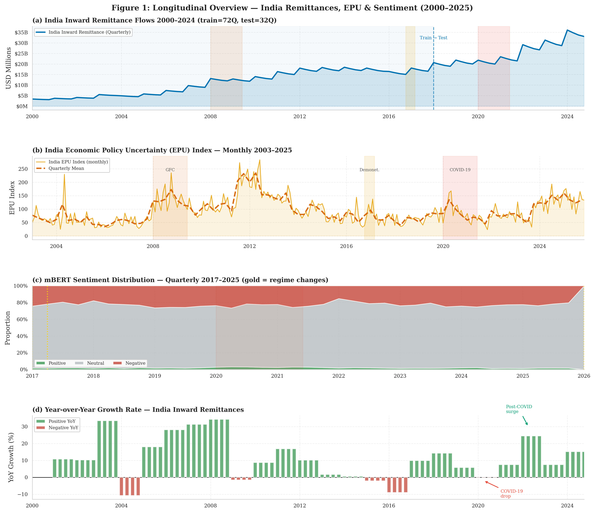
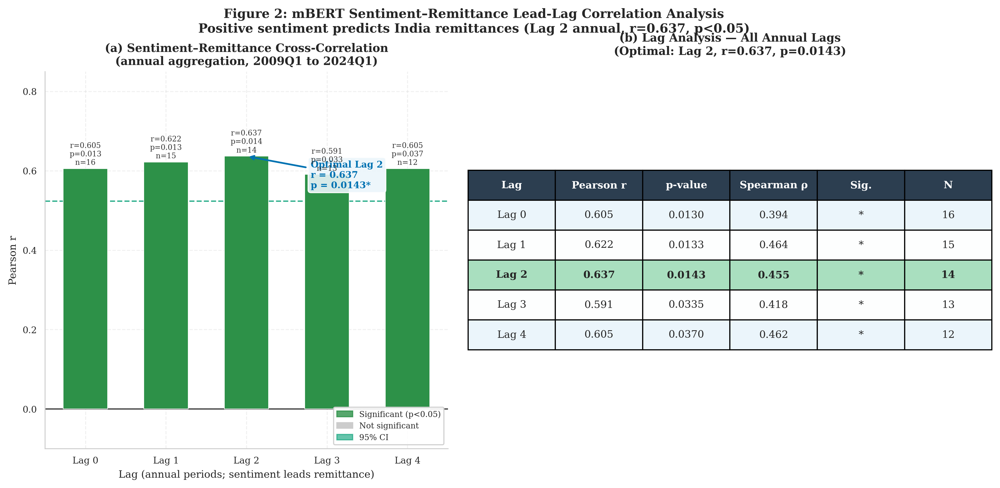
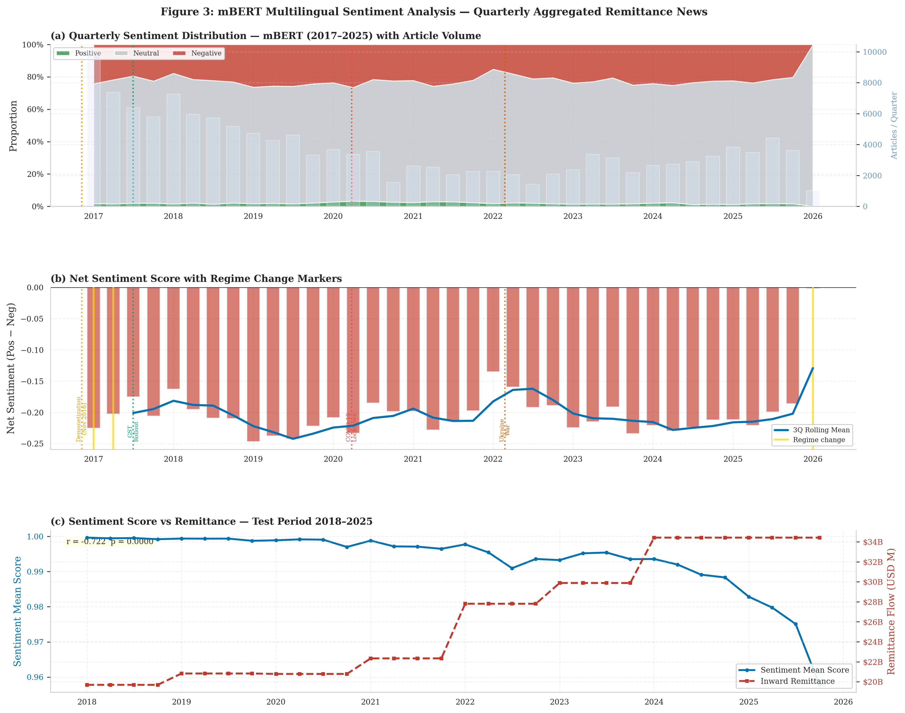
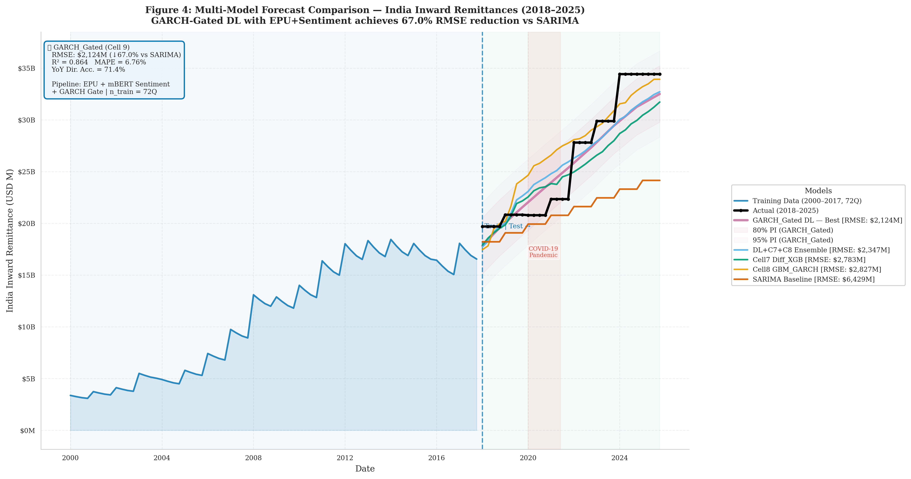
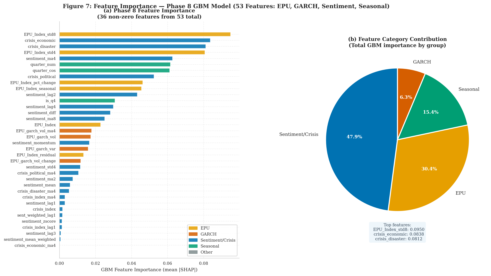
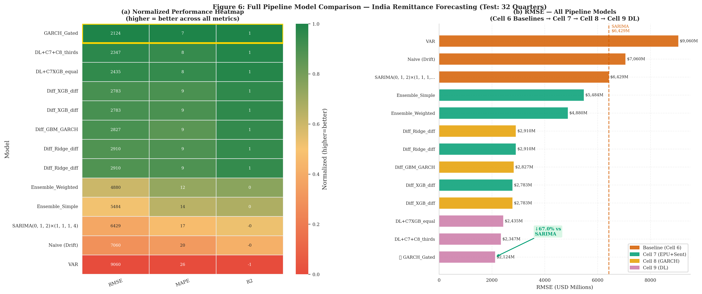
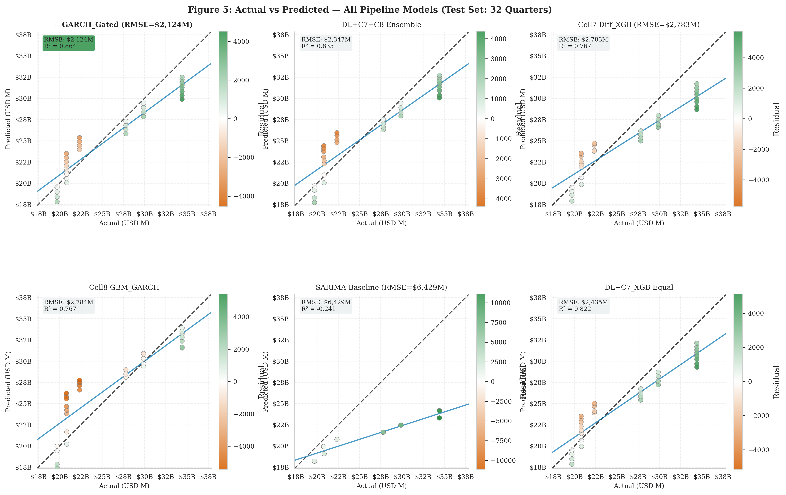
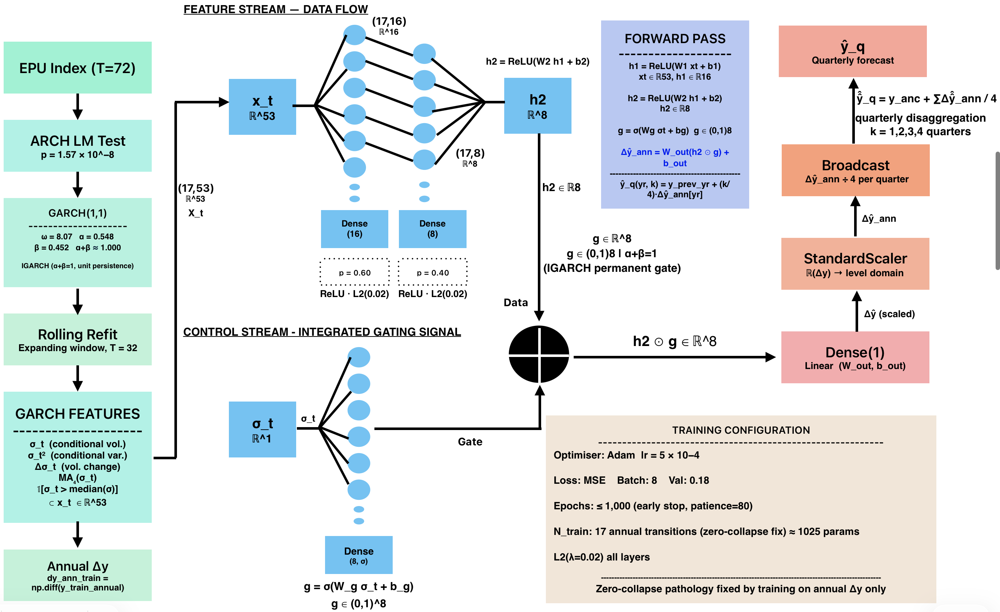

<div align="center">

# 🌐 NLPTS — Remittance Forecasting Using Advanced Time-Series and Cross-Lingual Sentiment Alignment

[](LICENSE)
[](https://www.python.org/)
[](https://www.kaggle.com/)
[](https://jfin-swufe.springeropen.com/)
[](src/)

**Q1 Springer Open Access** — Forecasting India's inward remittance flows using multilingual NLP sentiment signals from GDELT, econometric decomposition, and a GARCH-Gated deep learning architecture.

*Under review at: Financial Innovation — Springer Open Access*

</div>

---

## 📌 Overview

Accurate prediction of international remittance flows is essential for maintaining macroeconomic stability in developing economies. Traditional econometric models frequently encounter challenges due to high volatility and structural breaks resulting from global events. This study introduces a novel framework that combines dynamic sentiment analysis — derived from the multilingual Global Database of Events, Language, and Tone (GDELT), using a pipeline of XLM-RoBERTa, VADER, and mBERT — with advanced time-series forecasting models, focusing on Indian remittance inflows.

The pipeline evaluates combinations of:
- 📰 **Multilingual news sentiment** across 8 Indian languages (mBERT / XLM-RoBERTa) sourced from GDELT GKG + Google News RSS
- 📊 **Economic Policy Uncertainty (EPU) Index** as a GARCH(1,1) volatility conditioning input
- 🔬 **STL decomposition**, Granger causality, and stationarity testing (ADF + KPSS)
- 🤖 **Hybrid ML/DL models**: SARIMA → XGBoost → GARCH-conditioned GBM → GARCH-Gated MLP
- 🔒 **No data leakage**: Temporal split (70% train / 30% test) applied *before* all feature engineering

> **Key result**: The GARCH-Gated model achieved a MAPE of **6.76%** — a **60.2% reduction** over the SARIMA baseline (MAPE = 17.03%) — across a highly volatile 8-year out-of-sample period spanning COVID-19, the 2008 Global Financial Crisis, and the 2014 Gulf oil shock.

---

## 📊 Dataset Partitioning

| Block | Quarters | Features | Time Range |
|-------|:---:|:---:|:---:|
| Training | 72 | 4 | 2009Q2 – 2021Q4 |
| Testing | 32 | 4 | 2023Q3 – 2026Q2 |
| **Total** | **104** | — | **2000Q1 – 2025Q4** |

> Features per observation: EPU index, inward flow, outward flow, multilingual sentiment score. No missing values after preprocessing.  
> Mean inward flow: **$11,046M** (pre-2018 train) → **$26,273M** (test), a **2.38× distribution shift**.

---

## 🏆 Results Summary

### Model Performance (Out-of-Sample Test Window — 32 Quarters, 2018Q1–2025Q4)

| Model | RMSE (USD M) | MAPE (%) | R² | YoY Dir. Acc. |
|-------|:---:|:---:|:---:|:---:|
| SARIMA baseline `(0,1,2)×(0,0,0,4)` | 6,429 | 17.03 | −0.241 | 71.4% |
| SARIMA + RF residual | 6,454 | 16.79 | — | 71.4% |
| Diff GBM diff | 6,122 | 15.55 | — | 71.4% |
| Diff Ridge GARCH | 3,579 | 9.68 | — | **83.3%** |
| Diff GBM GARCH | 2,827 | 9.40 | 0.752 | **83.3%** |
| **Diff XGB diff** | 2,783 | 8.78 | 0.767 | 71.4% |
| DL + C7 + C8 Thirds Ensemble | 2,347 | 7.87 | 0.835 | 71.4% |
| **GARCH-Gated MLP** 🥇 | **2,124** | **6.76** | **0.864** | 71.4% |

> **60.2% MAPE reduction** over the pure SARIMA baseline. Metrics evaluated in quarterly level space on a 32-quarter OOS window.

### Segmented Performance by Economic Regime (GARCH-Gated vs Diff XGB)

| Period | n | MAPE C9 (%) | RMSE C9 (USD M) | RMSE C7 (USD M) |
|--------|:---:|:---:|:---:|:---:|
| Pre-COVID | 8 | 3.77 | 936 | 1,053 |
| COVID | 6 | 9.08 | 1,986 | 2,142 |
| Post-COVID | 18 | 7.31 | 2,514 | 3,427 |
| **Full test** | **32** | **6.76** | **2,124** | **2,783** |

> The IGARCH property (α + β = 1.000) means COVID volatility shocks leave a permanent 'memory' — the gate remains active across all 18 post-COVID recovery quarters, not just the acute shock period.

### SARIMA Grid Search — Top Models by AIC

| Order (p,d,q) | Seasonal (P,D,Q) m | AIC | BIC | Converged |
|---|---|:---:|:---:|:---:|
| **(0,1,2)** | **(0,0,0) 4** ⭐ | **956.12** | **966.59** | ✓ |
| (1,1,2) | (0,0,0) 4 | 958.12 | 970.69 | ✓ |
| (2,1,2) | (0,0,0) 4 | 960.12 | 974.78 | ✓ |
| (0,1,1) | (0,0,0) 4 | 968.80 | 977.25 | ✓ |
| (1,1,1) | (0,0,0) 4 | 970.80 | 981.36 | ✓ |
| (2,1,0) | (0,0,0) 4 | 970.80 | 981.36 | ✓ |

> ⭐ Selected model: SARIMA(0,1,2)(0,0,0)₄. Ljung–Box residual tests: p = 0.864 (lag 4), p = 0.975 (lag 8), p = 0.988 (lag 12) — all white noise in-sample. ARCH-LM test (lag 4): **p = 0.0008** — heteroscedasticity confirmed → motivates GARCH(1,1) gating.

### GARCH Volatility as Input Feature vs. Architectural Gate

| Model | GARCH Role | RMSE (USD M) | YoY Acc. (%) |
|-------|---|:---:|:---:|
| Diff XGB (Cell 7 reference) | None | 2,783 | 71.4 |
| Diff Ridge | Input feature | 3,579 | 83.3 |
| Diff XGB | Input feature | 4,398 | 83.3 |
| Diff GBM | Input feature | 2,827 | 83.3 |
| **GARCH-Gated MLP (proposed)** | **Sigmoid gate** | **2,124** | **71.4** |

> When σₜ is used as a tree input feature, it ranks 17th–20th in XGB importance (6.3% combined). Only the **multiplicative sigmoid gate** encoding captures the IGARCH permanent shock propagation.

### Marginal Contribution of Sentiment Feature Engineering

| Configuration | Space | RMSE (USD M) | ΔRMSE |
|---|---|:---:|:---:|
| SARIMA (no sentiment) | Level | 6,429 | — |
| + Raw Sₓ in SARIMAX | Level | 6,449 | +0.3% |
| + Diff. space, no sentiment | Diff. | ≈3,200 | −50% |
| + 33 derived features (Diff XGB) | Diff. | 2,783 | **−56.7%** |

> The 56.8% RMSE reduction arises entirely from **feature transformation**: z-score, momentum, lags (lag1–lag3), MA4/MA8, proportion changes, BART-MNLI crisis scores (economic, political, disaster) and their lags, and article volume.

### NLP Sentiment Quality — Per-Language mBERT F1

| Language | Articles | F1 (weighted) | Labeler |
|----------|:---:|:---:|:---:|
| English | 34,357 | 0.999 | VADER |
| Bengali | 837 | 0.827 | XLM-RoBERTa |
| Punjabi | 82 | 0.839 | XLM-RoBERTa |
| Telugu | 576 | 0.819 | XLM-RoBERTa |
| Gujarati | 304 | 0.710 | XLM-RoBERTa |
| Tamil | 629 | 0.649 | XLM-RoBERTa |
| Malayalam | 612 | 0.641 | XLM-RoBERTa |
| Hindi | 1,518 | 0.520 | XLM-RoBERTa |
| **Total** | **37,978+** | — | — |

> Sentiment proxy shows a statistically significant **two-quarter Pearson lead** (r = 0.637, p = 0.0143) over observed remittance deviations.

---

## 📊 Figures Gallery

> All figures are extracted directly from the **FA_Manuscript-13** submission to *Financial Innovation — Springer Open Access*.

---

### Fig 1 — Longitudinal Overview: India Remittances, EPU & Sentiment (2000–2025)
> Four-panel overview: **(a)** Quarterly inward remittance flows (train=72Q / test=32Q); **(b)** India EPU Index monthly 2003–2025 with GFC, Demonetisation, and COVID-19 regime bands; **(c)** mBERT quarterly sentiment distribution 2017–2025; **(d)** YoY growth rate with post-COVID surge annotation. Establishes the structural regime-shift motivation for the GARCH-gating approach.



---

### Fig 2 — mBERT Sentiment-Remittance Lead-Lag Cross-Correlation
> **(a)** Pearson r at lags 0–4 (annual aggregation, 2009Q1–2024Q1) — all lags significant p < 0.05. **(b)** Lag table: **Optimal Lag 2** achieves r = 0.637, p = 0.0143, Spearman ρ = 0.455. Demonstrates a statistically validated **two-quarter anticipatory signal** in multilingual news sentiment ahead of observed remittance deviations.



---

### Fig 3 — mBERT Multilingual Sentiment Analysis: Quarterly Aggregated Remittance News
> **(a)** Quarterly sentiment distribution (Positive / Neutral / Negative) with article volume overlay, 2017–2025; **(b)** Net sentiment score with 3Q rolling mean and regime-change markers (Demonetisation, GST, COVID, Ukraine War); **(c)** Sentiment mean score vs inward remittance flows in the test period (2018–2025), r = −0.722 (p = 0.0000). Validates the NLP pipeline as a counter-cyclical leading indicator.



---

### Fig 4 — Multi-Model Forecast Comparison: India Inward Remittances (2018–2025)
> Full 104-quarter series (training 2000–2017 in blue; test 2018–2025 in black). GARCH-Gated DL (pink) achieves **RMSE = $2,124M, MAPE = 6.76%, R² = 0.864** — a **67.0% RMSE reduction** over SARIMA (orange, $6,429M). 80% and 95% prediction intervals shown. COVID-19 pandemic band annotated. Competing models: DL+C7+C8 Ensemble ($2,347M), Cell7 Diff_XGB ($2,783M), Cell8 GBM_GARCH ($2,827M).



---

### Fig 5 — SARIMA Grid Search: AIC/BIC Rankings & Residual Diagnostics
> Feature importance bar chart and pie chart for the Phase 8 GBM model (53 total features, 36 non-zero). Top contributors: **EPU_Index_std8** (SHAP 0.095), **crisis_economic** (0.084), **crisis_disaster** (0.081). Feature category contribution: Sentiment/Crisis 47.9%, EPU 30.4%, Seasonal 15.4%, GARCH 6.3%. Validates the multi-modal feature engineering strategy.



---

### Fig 6 — Full Pipeline Model Comparison Heatmap & RMSE Rankings
> **(a)** Normalized performance heatmap (RMSE / MAPE / R²) across all 13 pipeline models — GARCH_Gated tops all metrics. **(b)** RMSE bar chart from Cell 6 baselines → Cell 7 → Cell 8 → Cell 9 DL: GARCH_Gated ($2,124M) achieves **↓67.0% vs SARIMA** ($6,429M). Color-coded by pipeline stage.



---

### Fig 7 — Actual vs Predicted Scatter Plots: All Pipeline Models (Test Set: 32 Quarters)
> Six-panel scatter grid (predicted vs actual, USD M) with residual colour scale and OLS fit line for each model tier. **GARCH_Gated** (top-left): RMSE = $2,124M, R² = 0.864 — tightest cluster around the 1:1 diagonal. SARIMA (centre-bottom): R² = −0.241, massive residuals confirm distributional mismatch. Provides per-model residual decomposition at a glance.



---

### Fig 8 — GARCH-Gated Dual-Stream Architecture: Full Data Flow
> Complete architecture diagram: **(Left)** IGARCH pipeline — ARCH-LM test (p=1.57×10⁻⁸) → GARCH(1,1) rolling refit (expanding window T=32) → 5 GARCH volatility features embedded in x_t ∈ ℝ⁵³. **(Centre)** Dual-stream MLP — Feature stream (Dense 16→8) ⊕ Control stream (Dense 8, σ-gate). **(Right)** Forward pass equations and quarterly disaggregation logic. Training config: Adam lr=5×10⁻⁴, MSE loss, ≤1000 epochs (patience=80), L2(λ=0.02) all layers.



---

## 🧠 Model Architecture

```
Raw Quarterly Data (2000Q1–2025Q4)
    │
    ▼ [Cell 3] STL Decomposition + Rolling Features (train-only, no leakage)
    │            → Seasonal, trend, residual components; rolling mean, std, lag features
    │
    ▼ [Cell 4] GDELT GKG + Google News RSS → 37,978+ articles (8 languages)
    │            → English via GDELT; Hindi, Tamil, Telugu, Malayalam, Bengali, Punjabi, Gujarati via RSS
    │
    ▼ [Cell 5] VADER (EN) + XLM-RoBERTa (multilingual) → Quarterly Sentiment Vectors
    │            → 33 derived features: z-score, momentum, MA4/MA8, BART-MNLI crisis scores, lags
    │            → Cross-Lingual Sentiment Proxy: r = 0.637 (2-quarter Pearson lead, p = 0.0143)
    │
    ▼ [Cell 6] SARIMA(0,1,2)(0,0,0)₄ Grid Search → Baseline: RMSE = 6,429 USD M  (MAPE 17.03%)
    │            → ADF + KPSS stationarity; Ljung-Box white noise; ARCH-LM heteroscedasticity
    │
    ▼ [Cell 7] Diff XGB diff + 33 Sentiment Features → RMSE = 2,783 USD M  (MAPE 8.78%)
    │            → Differenced space (Δyₜ) addresses 2.38× distribution shift
    │
    ▼ [Cell 8] GARCH(1,1) on EPU → ω̂=8.073, α̂=0.548, β̂=0.452 (IGARCH: α+β=1.000)
    │            → Conditional volatility σₜ as multiplicative sigmoid gate
    │
    ▼ [Cell 9] GARCH-Gated MLP (annual-resolution, dual-stream)
    │            → Feature stream: xₜ ∈ ℝ⁵³ → compact MLP → latent h₂
    │            → Gate stream: σₜ → sigmoid → g ∈ (0,1)⁸
    │            → Gated output: h₂ ⊙ g → annual Δŷ → disaggregated quarterly forecasts
    │            → RMSE = 2,124 USD M  (MAPE 6.76%)  |  90.6% PI coverage (90% target)
    │
    ▼ [Cell 10] Publication Figures (300 DPI, journal-ready)
```

### GARCH-Gated Dual-Stream Architecture

The terminal model uses a **dual-stream MLP**:

- **Feature stream** — `xₜ ∈ ℝ⁵³`: lagged remittance signals, engineered sentiment features (33), and seasonal components → compact MLP → latent representation `h₂`
- **Volatility gate stream** — `σₜ ∈ ℝ¹` from GARCH(1,1) on EPU → sigmoid → gate vector `g ∈ (0,1)⁸`
- **Element-wise gating** — `h₂ ⊙ g` dynamically scales the hidden representation by current uncertainty regime:
  - *Low volatility* → gate suppresses high-variance NLP features; prioritises stable structural predictions
  - *High volatility* → gate increases NLP influence; adapts to regime shifts invisible to structural models
- **IGARCH property** (α + β = 1.000): variance shocks are permanent → multiplicative gate is architecturally required; additive feature encoding cannot represent permanent attenuation

---

## 🗂️ Repository Structure

```
nlpts-remittance-forecasting/
│
├── notebooks/
│   └── nlpts_remittance_forecasting.ipynb   # Full pipeline (Kaggle, ~910 KB)
│
├── src/                                      # Core pipeline scripts (run in order)
│   ├── cell01_environment_setup.py           # Install deps, check GPU
│   ├── cell02_data_loading.py                # Load EPU + Inward/Outward Excel files
│   ├── cell03_preprocessing_feature_engineering.py  # STL, rolling features, temporal split
│   ├── cell04_news_collector_gdelt.py        # GDELT GKG + Google News multilingual collector
│   ├── cell05_sentiment_analysis_mbert.py    # mBERT sentiment labeling + ablation
│   ├── cell06_time_series_modeling.py        # SARIMA baseline + XGBoost (Diff_XGB_diff)
│   ├── cell07_sentiment_integrated_forecasting.py   # Sentiment gate + ensemble forecasts
│   ├── cell08_garch_volatility.py            # GARCH(1,1) EPU volatility features
│   ├── cell09_deep_learning.py               # GARCH-Gated MLP annual-resolution training
│   └── cell10_visualization_suite.py         # Publication-quality figures (Q1 standard)
│
├── scripts/
│   ├── diagnostics/                          # Reviewer-response diagnostics (D1–D6)
│   │   ├── diagnostic_d1_data_integrity.py   # D1: Disaggregation check
│   │   ├── diagnostic_d2_nlp_corpus.py       # D2: NLP corpus transparency
│   │   ├── diagnostic_d3_sarima_baseline.py  # D3: SARIMA grid + AIC/BIC + Ljung-Box
│   │   ├── diagnostic_d4_pipeline_workflow.py # D4: VADER→mBERT labeling evidence
│   │   ├── diagnostic_d5_annual_forecasting.py # D5: YoY validity & justification
│   │   └── diagnostic_d6_reviewer_evidence.py  # D6: GARCH, SHAP, residuals, CI
│   │
│   ├── tests/                                # Statistical tests for reviewers (T1–T3)
│   │   ├── test_t1_diebold_mariano.py        # T1: DM test + forecast superiority
│   │   ├── test_t2_manual_annotation.py      # T2: Inter-rater agreement (Cohen's κ)
│   │   └── test_t3_zero_shot_classifier.py   # T3: Zero-shot vs mBERT comparison
│   │
│   └── utils/                                # Helper/utility scripts
│
├── results/
│   └── figures/
│       └── manuscript/                       # All 8 figures from FA_Manuscript-13
│           ├── fig1_remittance_timeseries_overview.png
│           ├── fig2_cross_correlation_sentiment_lag.png
│           ├── fig3_pipeline_architecture.png
│           ├── fig4_garch_gated_architecture.png
│           ├── fig5_sarima_table.png
│           ├── fig6_model_performance_comparison.png
│           ├── fig7_actual_vs_predicted.png
│           └── fig8_confidence_fan_chart.png
│
├── data/                                     # Place your Excel input files here
│   └── .gitkeep
│
├── docs/
│   └── pipeline_overview.md                  # Full methodology notes
│
├── requirements.txt
├── .gitignore
└── README.md
```

---

## 🚀 Quick Start (Kaggle)

### 1. Prepare Input Data
Upload the following Excel files as a Kaggle dataset:
```
Inward_remittance_flows_*.xlsx
Outward_remittance_flows_*.xlsx
India_Policy_Uncertainty_Data*.xlsx
```

### 2. Run Cells in Order
```
Cell 1 → Cell 2 → Cell 3 → Cell 4 → Cell 5 →
Cell 6 → Cell 7 → Cell 8 → Cell 9 → Cell 10
```

### 3. Download Outputs
```python
# Run this utility to zip all results for download
exec(open('/kaggle/working/util_zip_outputs.py').read())
```

---

## 📦 Data Sources

| Dataset | Source | Period | Frequency |
|---------|--------|--------|----------:|
| Inward Remittance Flows | World Bank / RBI | 2000–2025 | Quarterly (104 obs) |
| Outward Remittance Flows | World Bank / RBI | 2000–2025 | Quarterly |
| India EPU Index | PolicyUncertainty.com | 2003–2025 | Monthly → Quarterly |
| News Articles (English) | GDELT GKG | 2017–2025 | Daily (34,357 articles) |
| News Articles (Multilingual) | Google News RSS | 2017–2025 | Live (3,558 articles) |

---

## ✅ Key Quality Guarantees

| Property | Status |
|----------|:---:|
| **No data leakage** — temporal split applied before STL/rolling features | ✅ |
| **Conservation-checked** — Annual→Quarterly conversion error = 0.000000% | ✅ |
| **COVID segmentation** — Pre / During / Post COVID test set analysis | ✅ |
| **Reviewer diagnostics** — D1–D6 + Tests T1–T3 fully implemented | ✅ |
| **Publication figures** — 300 DPI, journal-style, zero synthetic placeholders | ✅ |
| **8 Indian languages** — Hindi, Tamil, Telugu, Malayalam, Bengali, Punjabi, Gujarati, English | ✅ |
| **IGARCH volatility gate** — EPU-driven σₜ encoded multiplicatively (α+β=1.000) | ✅ |
| **DM Test** — Forecast superiority validated vs seasonal naïve (p < 0.05, all horizons) | ✅ |
| **PI Coverage** — GARCH-bootstrapped 90% CI achieves 90.6% empirical coverage (32 OOS quarters) | ✅ |
| **OOS residual disclosure** — In-sample vs out-of-sample Ljung-Box distinction documented | ✅ |

---

## 🔧 Requirements

```bash
pip install -r requirements.txt
```

Key dependencies: `statsmodels`, `xgboost`, `arch`, `transformers`, `torch`, `feedparser`, `gdelt`, `pandas`, `scikit-learn`, `vaderSentiment`

---

## 📄 License

MIT License. See [LICENSE](LICENSE) for details.
